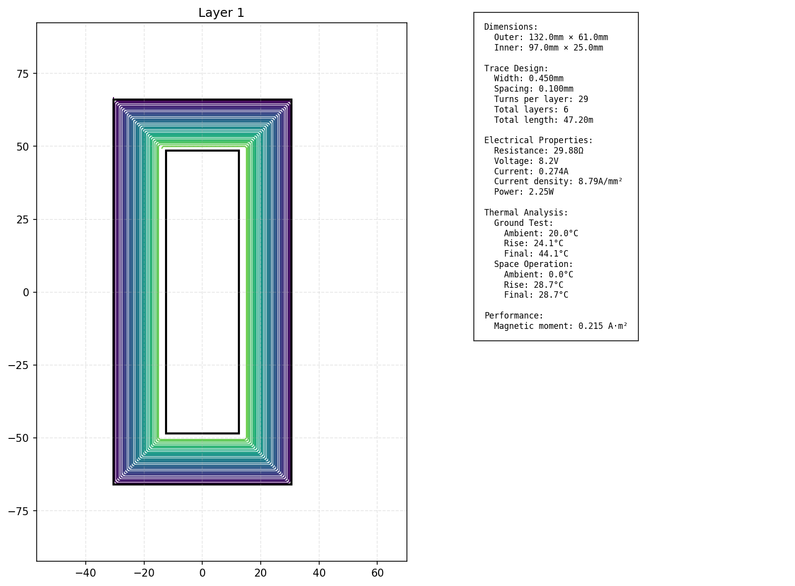

# Magnetorquer Designer

A comprehensive tool for designing and optimizing PCB-based magnetorquer coils for spacecraft attitude control. This software suite includes physical optimization, thermal analysis, and automated PCB trace generation.

## Overview

This toolset provides end-to-end design capabilities for PCB-based magnetorquers:
- Physics-based design optimization
- Thermal analysis for both ground testing and space operations
- Automated trace generation for KiCad
- 2D visualization of coil layers



## Usage

1. Configure design constraints in `constraints.json`:
   ```json
   {
     "design_constraints": {
       "num_layers": 6,
       "voltage": 8.2,
       "max_power": 4
       // ... other constraints
     }
   }
   ```

2. Run the optimizer:
   ```bash
   python design.py
   ```

3. Generate visualization:
   ```bash
   python 2d-sketch.py
   ```

4. Create KiCad PCB:
   - Open KiCad PCB Editor
   - Open Python console (Tools > Scripting Console)
   - Copy and paste functions from `kicad.py`
   - Run `main()`

### Output Files

- `design.json`: Complete design specifications
- `output/magnetorquer_layer_*.png`: Layer-by-layer visualizations
- KiCad PCB files with generated traces

## Optimization Physics

The optimization process balances multiple physical constraints and objectives to maximize the magnetic moment while ensuring reliable operation. Here's a detailed breakdown of the physics involved:

### 1. Magnetic Moment Optimization

The primary objective is to maximize the magnetic moment (μ), which determines the torque capability of the magnetorquer:

```
μ = n * I * A * L
where:
n = number of turns per layer
I = operating current
A = area per turn
L = number of layers
```

The optimizer balances these factors:
- Increasing turns (n) increases total area but reduces current capacity
- Wider traces allow more current but reduce available turns
- Multiple layers multiply the effect but add thermal challenges

### 2. Current and Resistance Calculations

Current is limited by both power and thermal constraints:

a) Resistance calculation with temperature compensation:
```
R = ρ₀(1 + α∆T) * total_length / (w * t)
where:
ρ₀ = base copper resistivity (1.68e-8 Ω⋅m)
α = temperature coefficient (0.00393 /°C)
∆T = temperature rise
w = trace width
t = copper thickness
```

b) Current limitations:
```
I = min(V/R, I_thermal, I_max)
where:
V = supply voltage
I_thermal = maximum current based on thermal constraints
I_max = absolute maximum current rating
```

### 3. Thermal Analysis

The optimizer solves a complex thermal equilibrium equation for both ground and space scenarios:

Ground testing:
```
P_in = P_radiation
I²R = εσA(T⁴ - T_ambient⁴)
where:
ε = emissivity
σ = Stefan-Boltzmann constant
A = surface area
T = temperature of the magnetorquer's surface
T_ambient = room temperature
```

Space operation:
```
P_in = P_radiation
I²R = εσA(T⁴ - T_space⁴)
T_space = base temperature of satellite components
```

### 4. Manufacturing Constraints

The physical design must respect manufacturing limitations:
```
w_trace ≥ w_min (minimum manufacturable trace width)
s_trace ≥ s_min (minimum trace spacing)
j ≤ j_max (current density limit)
where:
j = I/(w_trace * t_copper)
```

### 5. Optimization Strategy

The optimizer uses Sequential Least Squares Programming (SLSQP) to:

1. Start with initial trace width guess
2. For each iteration:
   - Calculate maximum possible turns
   - Determine total resistance
   - Solve thermal equilibrium
   - Calculate resulting magnetic moment
   - Adjust parameters to maximize moment while satisfying constraints

The process uses gradient-based optimization to find the global maximum magnetic moment while satisfying all constraints. Key constraints include:

```python
# Power constraint
I²R ≤ P_max

# Thermal constraint
T_final ≤ T_max

# Current density constraint
I/(w * t) ≤ j_max

# Geometric constraints
n_turns * (w + s) ≤ (outer_dim - inner_dim)/2
```

### Trace Generation Algorithm

The trace generation uses a sophisticated algorithm to create optimal coil patterns:

1. Layer Organization
   - N-1 layers for coil windings (where N is total layers)
   - Final layer reserved for H-bridge connections
   - Each layer alternates winding direction for optimal inductance

2. Turn Calculation
   ```python
   max_turns = min(
       (outer_length - effective_inner_length) / (2 * turn_pitch),
       (outer_width - effective_inner_width) / (2 * turn_pitch)
   )
   where:
   turn_pitch = trace_width + trace_spacing
   ```

3. Clearance Management
   - Maintains minimum clearance from inner cutout
   - Ensures proper spacing for layer interconnects
   - Accounts for manufacturing constraints

4. Layer Interconnections
   - Optimized via placement for layer transitions
   - Minimized crossing points to reduce parasitic effects
   - Maintained consistent impedance through transitions

## Dependencies

- Python 3.7+
- NumPy
- SciPy
- Matplotlib
- KiCad 6.0+

## License

MIT License

## Contributing

Contributions welcome! Please read the contributing guidelines before submitting pull requests.